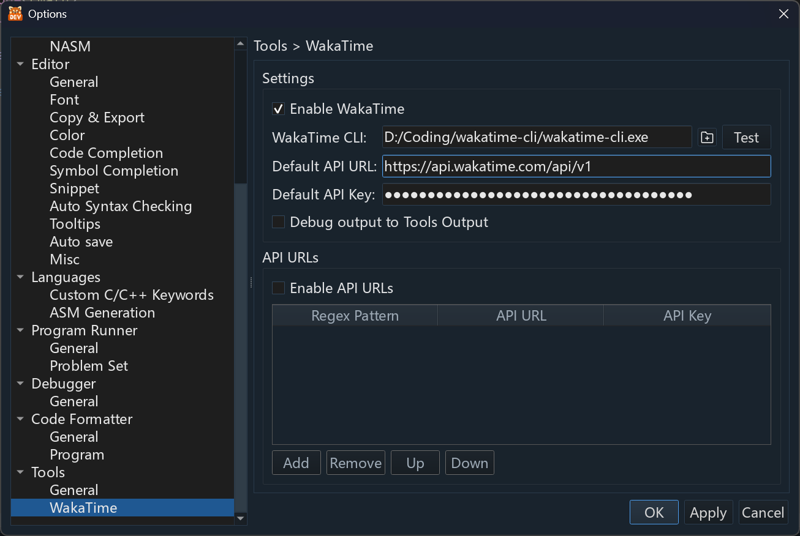

# RedPanda C++ 

> [!NOTE]
> 这是一个供个人使用的构建版本，集成了实验性的 WakaTime 功能。

小熊猫C++ (曾经用过的名称: 小熊猫Dev-C++ 7) 是一款快速、轻量、开源并且跨平台的C/C++/GNU的编译工具。(Assembly IDE).

上游项目简体中文网站: [http://royqh.net/redpandacpp](http://royqh.net/redpandacpp)

上游项目英文网站: [https://sourceforge.net/projects/redpanda-cpp](https://sourceforge.net/projects/redpanda-cpp)

[为上游项目捐款](https://ko-fi.com/royqh1979)

## WakaTime 集成

### 配置

1. 安装 `wakatime-cli` 并找到它的可执行文件。
2. 打开 **选项 > 工具 > WakaTime**。
3. 启用 WakaTime，选择 CLI 可执行文件，然后输入 API URL 和 API Key。
4. 点击 **Test**，确认 CLI 可以正常运行。
5. 点击 **应用** 或 **确定** 保存设置。

默认 API URL 为 `https://api.wakatime.com/api/v1`。启用 **API URLs** 后，可使用正则表达式规则将匹配文件的活动发送到不同的端点或账户。

新特性 (相对于上一版本：Red Panda Dev-C++ 6):
* 集成 WakaTime，用于跟踪编码活动
* 跨平台 (Windows/Linux/MacOS)
* 编辑、管理和使用试题集来测试程序(根据预定义的输入运行程序，比较实际输出和预期结果)。
* 支持Competitive Companion(chrome/firefox浏览器的插件)，从OJ网站上下载试题集。
* 编辑、编译、运行、调试汇编语言程序(GNU汇编器 / NASM).
* 查找符号引用。
* 在调试时查看内存查看功能。
* TODO标签管理
* 支持SDCC编译器

交互界面改进：
* 完整的高dpi支持，包括对字体和图标的支持
* 更好的支持深色主题
* 更好的支持编辑器配色方案
* 重新设计的“在文件中查找/替换”UI
* 重新设计的书签交互界面

编辑器改进：
* 增强的自动缩进功能
* 增强的代码自动完成功能
* 更好的代码折叠支持功能

调试改进：
* 使用gdb/mi接口
* 增强型监测
* gdbserver模式

代码智能感知改进：
* 更好地支持复杂表达式的标识符
* 支持UTF-8标识符
* 使用类型别名支持C++14
* 支持C样式枚举变量定义
* 用参数支持MACRO
* 支持C++lambdas表达式

以及许多其他改进和错误修复。有关详细信息，请参阅NEWS.md。

## 致谢

[Lua](https://www.lua.org/) 5.4.6 ([源代码镜像](https://github.com/lua/lua/tree/v5.4.6)) 用作附加组件运行环境。
- 上游项目 [royqh1979/RedPanda-CPP](https://github.com/royqh1979/RedPanda-CPP) 由 royqh1979 创建。
